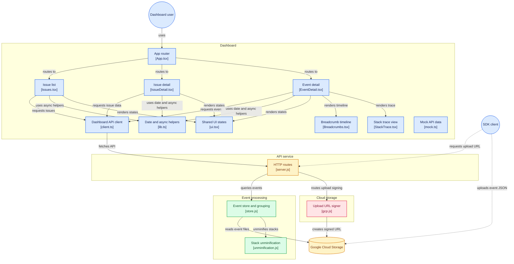

%% Generated by https://gitdiagram.com/kunal-vashisht/sdk-server

```mermaid
flowchart TD

subgraph group_dashboard["Dashboard"]
  node_app["App router<br/>[App.tsx]"]
  node_issue_list["Issue list<br/>[Issues.tsx]"]
  node_issue_detail["Issue detail<br/>[IssueDetail.tsx]"]
  node_event_detail["Event detail<br/>[EventDetail.tsx]"]
  node_breadcrumbs["Breadcrumb timeline<br/>[Breadcrumbs.tsx]"]
  node_stack_trace["Stack trace view<br/>[StackTrace.tsx]"]
  node_ui["Shared UI states<br/>[ui.tsx]"]
  node_client_lib["Date and async helpers<br/>[lib.ts]"]
  node_api_client["Dashboard API client<br/>[client.ts]"]
  node_mock_api["Mock API data<br/>[mock.ts]"]
end

subgraph group_api["API service"]
  node_server["HTTP routes<br/>[server.js]"]
end

subgraph group_processing["Event processing"]
  node_store["Event store and grouping<br/>[store.js]"]
  node_unminify["Stack unminification<br/>[unminification.js]"]
end

subgraph group_cloud["Cloud storage"]
  node_sign_url["Upload URL signer<br/>[gcp.js]"]
end

node_engineer(("Dashboard user"))
node_sdk(("SDK client"))
node_gcs[("Google Cloud Storage")]

node_engineer -->|"uses"| node_app
node_app -->|"routes to"| node_issue_list
node_app -->|"routes to"| node_issue_detail
node_app -->|"routes to"| node_event_detail
node_issue_list -->|"requests issues"| node_api_client
node_issue_detail -->|"requests issue data"| node_api_client
node_event_detail -->|"requests event"| node_api_client
node_issue_list -->|"uses async helpers"| node_client_lib
node_issue_detail -->|"uses date and async helpers"| node_client_lib
node_event_detail -->|"uses date and async helpers"| node_client_lib
node_issue_list -->|"renders states"| node_ui
node_issue_detail -->|"renders states"| node_ui
node_event_detail -->|"renders states"| node_ui
node_event_detail -->|"renders timeline"| node_breadcrumbs
node_event_detail -->|"renders trace"| node_stack_trace
node_api_client -->|"fetches API"| node_server
node_sdk -.->|"requests upload URL"| node_server
node_server -->|"queries events"| node_store
node_server -->|"routes upload signing"| node_sign_url
node_store -->|"reads event files"| node_gcs
node_store -->|"unminifies stacks"| node_unminify
node_sign_url -->|"creates signed URL"| node_gcs
node_sdk -.->|"uploads event JSON"| node_gcs

click node_app "https://github.com/kunal-vashisht/sdk-server/blob/main/client/src/App.tsx"
click node_issue_list "https://github.com/kunal-vashisht/sdk-server/blob/main/client/src/pages/Issues.tsx"
click node_issue_detail "https://github.com/kunal-vashisht/sdk-server/blob/main/client/src/pages/IssueDetail.tsx"
click node_event_detail "https://github.com/kunal-vashisht/sdk-server/blob/main/client/src/pages/EventDetail.tsx"
click node_breadcrumbs "https://github.com/kunal-vashisht/sdk-server/blob/main/client/src/components/Breadcrumbs.tsx"
click node_stack_trace "https://github.com/kunal-vashisht/sdk-server/blob/main/client/src/components/StackTrace.tsx"
click node_ui "https://github.com/kunal-vashisht/sdk-server/blob/main/client/src/components/ui.tsx"
click node_client_lib "https://github.com/kunal-vashisht/sdk-server/blob/main/client/src/lib.ts"
click node_api_client "https://github.com/kunal-vashisht/sdk-server/blob/main/client/src/api/client.ts"
click node_mock_api "https://github.com/kunal-vashisht/sdk-server/blob/main/client/src/api/mock.ts"
click node_server "https://github.com/kunal-vashisht/sdk-server/blob/main/server/server.js"
click node_store "https://github.com/kunal-vashisht/sdk-server/blob/main/server/store.js"
click node_unminify "https://github.com/kunal-vashisht/sdk-server/blob/main/server/unminification.js"
click node_sign_url "https://github.com/kunal-vashisht/sdk-server/blob/main/server/utils/gcp.js"

classDef toneNeutral fill:#f8fafc,stroke:#334155,stroke-width:1.5px,color:#0f172a
classDef toneBlue fill:#dbeafe,stroke:#2563eb,stroke-width:1.5px,color:#172554
classDef toneAmber fill:#fef3c7,stroke:#d97706,stroke-width:1.5px,color:#78350f
classDef toneMint fill:#dcfce7,stroke:#16a34a,stroke-width:1.5px,color:#14532d
classDef toneRose fill:#ffe4e6,stroke:#e11d48,stroke-width:1.5px,color:#881337
classDef toneIndigo fill:#e0e7ff,stroke:#4f46e5,stroke-width:1.5px,color:#312e81
classDef toneTeal fill:#ccfbf1,stroke:#0f766e,stroke-width:1.5px,color:#134e4a
class node_app,node_issue_list,node_issue_detail,node_event_detail,node_breadcrumbs,node_stack_trace,node_ui,node_client_lib,node_api_client,node_mock_api,node_engineer,node_sdk toneBlue
class node_server,node_gcs toneAmber
class node_store,node_unminify toneMint
class node_sign_url toneRose

```